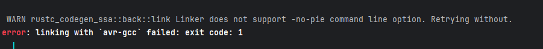

# Launching the project on your machine

You first have to build the project with the next command (you may have installed nightly):

cargo +nightly build -Z build-std=core --target avr-unknown-gnu-atmega328 --release

You should have an error like this :

Then install avr-gcc and run this command :

C:/WinAVR-20100110/bin/avr-gcc.exe -mmcu=atmega328 -o output.elf ./target/avr-unknown-gnu-atmega328/release/deps/*.o ./target/avr-unknown-gnu-atmega328/release/deps/*.rlib

Then, we need to convert the .elf file into a .hex file.

avr-objcopy -O ihex target/avr-unknown-gnu-atmega328/release/simple_blink.elf output.hex

Finally, we can execute this code with qemu:

qemu-system-avr -machine uno -nographic -bios output.hex

