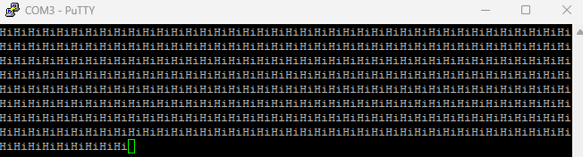

# Launching the project on your machine

 - For the atmega, you can juste download the ouput.hex file if you want to execute the code, but if you want to modify the code and test it by yourself, you'll have to follow the next steps.
 - For the thumbv7em-none-eabihf, just run the 2 commands below

## Arduino Uno (Atmega328p)

You first have to build the project with the next command (you may have installed nightly):

```
cargo +nightly build -Z build-std=core --target avr-atmega328p.json --release --bin atmega
/mnt/c/avr/avr-gcc-14.1.0-x64-windows/bin/avr-gcc.exe -mmcu=atmega328 -o output.elf -nostartfiles ./target/avr-atmega328p/release/deps/*.o ./target/avr-atmega328p/release/deps/*.rlib
/mnt/c/avr/avr-gcc-14.1.0-x64-windows/bin/avr-objcopy.exe -O ihex ./output.elf output.hex
C:\avr\avr-gcc-14.1.0-x64-windows\bin\avrdude.exe -C C:\avr\avr-gcc-14.1.0-x64-windows\bin\avrdude.conf -v -patmega328p -carduino -PCOM3 -b115200 -Uflash:w:output.hex:i
```

With the last command you are flashing a physical Atmega328p card, but if you don't have one, you can execute this code with qemu (next part).

Now, using Putty or another tool, you can see that the card transmit "Hi" to us, then we send data to it (you have 3 seconds to send data), it receives the data and transmit it back to us:



### With qemu 
```

```

## thumbv7em-none-eabihf


```
cargo build --target thumbv7em-none-eabihf --bin thumbv7
socat -d -d pty,raw,echo=0 pty,raw,echo=0
cargo run --bin thumbv7
putty
```


[CORRECTION USART] (Don't hesitate to remove this part)
I realise I didn't push the GPIO correction message ! Very sorry about that. Your project seems very clean right now (the message was "You should not use an external HAL.", wich is irrelevant now), I am happy it didn't cause trouble.
I did evaluate your USART project with this issue in mind.
It would be better to abstract more your code by dfining variable for memory adresses rather than using them directly in expressions.
You could try implementing the different USART mode (asynchrone double speed for example) for your Atmega target.
For your CORTEX M4 target, you could abstract the choice of USART, or the possibility to do asynchronous for example.

[CORRECTION SPI] (don't hesitate to remove this part)
You didn't implement the SPI feature for your CORTEX M7 target.
For your ATMEGA target, you didn't implement the reception part of the SPI feature.
You should also implement the peripheral/slave mode as well (not only the controler/master mode).
You could abstract more the register content, for example 0b01010001 is not very explicit, you may want to customize your parameters more accurately (therefore you could use more freely all the part of your registers CPOL, CPHA, BR, MSTR...).
Your SPI feature is fit for the ATMEGA target, but you didn't put conditionnal compilation for this feature (as you did for your USART feature for example). Therefore, the code can be compiled for the CORTEX target, even though it is designed for the ATMEGA target (with ATMEGA specific registers and logic).