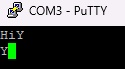

# Launching the project on your machine

## Arduino Uno (Atmega328p)

You first have to build the project with the next command (you may have installed nightly):

```
cargo +nightly build -Z build-std=core --target avr-atmega328p.json --release --bin atmega
/mnt/c/avr/avr-gcc-14.1.0-x64-windows/bin/avr-gcc.exe -mmcu=atmega328 -o output.elf ./target/avr-atmega328p/release/deps/*.o ./target/avr-atmega328p/release/deps/*.rlib
/mnt/c/avr/avr-gcc-14.1.0-x64-windows/bin/avr-objcopy.exe -O ihex ./output.elf output.hex
C:\avr\avr-gcc-14.1.0-x64-windows\bin\avrdude.exe -C C:\avr\avr-gcc-14.1.0-x64-windows\bin\avrdude.conf -v -patmega328p -carduino -PCOM3 -b115200 -Uflash:w:output.hex:i
```

With the last command you are flashing a physical Atmega328p card, but if you don't have one, you can execute this code with qemu (next part).

Now, using Putty or another tool, we should have an infinite loop with something like this while the led is blinking (the receive function is not yet functionnal):


```
qemu-system-avr -machine uno -bios output.elf -s -S
```

Then in another shell with gdb : 
````
avr-gdb simple_blink.elf
target remote localhost:1234
break main
continue
````
## thumbv7em-none-eabihf

```
cargo build --target thumbv7em-none-eabihf --bin main
cargo run --bin main
```
